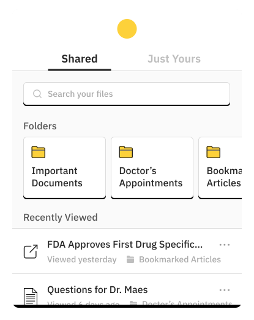

In April 2016, IBM and the American Cancer Society announced a partnership to create a Watson mobile app for those fighting cancer.

## Background

Founded in 1913, the American Cancer Society (ACS) sought to raise public awareness on a subject that was, at the time, responded to with fear and silence. Since then, cancer deaths have <a href="https://www.cancer.org/about-us/who-we-are/our-history.html" target="_blank">dropped 25%</a> in the United States and open conversations have become vital to a higher quality of life during cancer experiences.

However, even with advances in modern medicine and supportive care, <a href="https://www.ncbi.nlm.nih.gov/pubmed/25180371" target="_blank">numerous</a> <a href="https://www.ncbi.nlm.nih.gov/pubmed/12923796" target="_blank">studies</a> still show concern that lay understanding of cancer is suboptimal. *Patients and their caregivers lack the medical framework to fully comprehend and manage their cancer.*

<blockquote class="hasQuotes">
  
Information acquired [in the 100 days following diagnosis] shapes and defines patients' perspective about their condition.

    <cite>
      
Weisman AD, Worden JW

      
The existential plight in cancer: significance of the first 100 days.

    </cite>
</blockquote>

In order to empower conversations around cancer, ACS and IBM saw an opportunity to combine powerful resources from both sides: ACS's massive database of cancer knowledge and IBM's artificial intelligent features, widely personified as "Watson". *The mission was to build a consumer-facing mobile app that empowers patients and caregivers to be more educated about their cancer.*

## My Role

This was an ambitious project spearheaded by an early product development team within IBM. *I joined as the product designer in October 2016 and worked with a project lead and three user researchers.*

Together, we were responsible for biweekly updates to both ACS and IBM stakeholders as well as the final hand off to the production team in February 2017.

## Early Insights

To begin, we leveraged our partnership to speak to specialists at ACS facilities, including a call center in Austin and <a href="https://www.cancer.org/treatment/support-programs-and-services/patient-lodging/hope-lodge.html" target="_blank">Hope Lodges</a> in Boston and New York.

*Our objective was to understand the information-seeking patterns and needs of cancer patients when they reach out to these facilities.* This is what we learned:

### Recognize credible and updated sources
As information online continues to be more comprehensive and accessible, patients struggled to recognize credible and truthful sources. This is especially difficult as the medical domain around cancer is constantly updating.

### Find relevancy in a sea of information
Patients often dialed in to the ACS call center to ask: of all the information that they were given and had available, what was actually relevant to their diagnosis and progress?

### Build meaningful conversation with doctors
When patients looked up information outside of a doctor's appointment, their goals typically were to prepare more educated questions for the next consult, become more confident about their doctor's decisions, and follow up on any confusing concepts.

## The Cancer Journey

Nearly 40% of men and women in the US will be diagnosed with cancer within their lifetime. Each patient and their caregiver stands to undergo the most emotionally and physically significant experience they will ever have.

*To understand this experience, we interviewed 12 patients, 18 caregivers, and 43 healthcare professionals ranging between oncologists, nurses, and medical assistants.*

<figure class="js--zoom">
  
  <figcaption>High level representation of what we've learned about a user's cancer journey</figcaption>
</figure>

## Guiding Principles

After 4 months of iterative user research, we were able to arrive at numerous key insights. From these, *we created the following guiding principles going forward:*

### 1. Help navigate information noise, not add to it

We observed that patients didn't really struggle with a lack of information. Instead, they were usually so overwhelmed with information that they often needed ways to keep it all organized.

Therefore, we should not crowd them with new information sources and only surface things that are relevant.

### 2. Strengthen human relationships

At the end of the day, althought patients described their cancer experience as truly a battle, they also expressed immense gratitude and felt an incredible bond for those who around them throughout the journey.

As a result, we should never replace the roles of a patient's caregiver or their medical care team. Instead, we need to get tedious tasks out of the way so that they can just focus on providing support.

### 3. Handle sensitive data with upfront transparency

Patients didn't actually mind sharing their diagnosis and stories because talking about their cancer was a cathartic exercise. Instead, they were mindful of why unfamiliar prompters (particularly websites and researchers) wanted that information.

In turn, we need to be honest about our usage of any sensitive information before asking for it.

## Design Solutions

After more than 4 months of collective research, we proposed a final solution that was tiered into the three major deliverables.

### Short-Term: A cohesive home for cancer research

<!-- Even more frustrating than being diagnosed with cancer was not being able to understand it. When something so personal was affecting their lives, patients felt the need to understand it and how it would might impact their immediate future.

But as we'd already found, patients rarely lacked resources to find their answers. Rather, they were usually so overwhelmed with information that they would have to organize it into a "cancer binder", which they brought with them to every doctor's appointment. -->

With an incredibly difficult journey ahead of them, patients and caregivers frequently kept a "cancer binder" between them to keep track of medical history, research materials, medications, symptoms, and more.

Patients would then bring this binder with them to every medical appointment but over time, it was also cumbersome, non-replicable, and difficult to index.

Therefore, at the core of our design solution, we designed a central space to create and keep resources 

<figure>
  
  <!-- <figcaption>High level representation of what we've learned about a user's cancer journey</figcaption> -->
</figure>

### Mid-Term: Revisit appointments with a summarized transcript

Caregivers often accompanied patients to their oncology appointments in order to be an extra pair of ears and take copious notes. However, caregivers still struggled to properly capture the medical jargon or concepts that doctors may bring up.

As a result, doctors said that *patients often recorded their consultation sessions even when their caregivers came in with them.* They would then take the tape home, rewind to understand the content, and come back with more questions.

To improve this experience, we will leverage Watson's live speech-to-text capabilities 

### Long-Term: Get access to experts with the context they need

And with no way for ACS to track caller information, return callers found that they had to answer basic questions about their medical history each and every time.