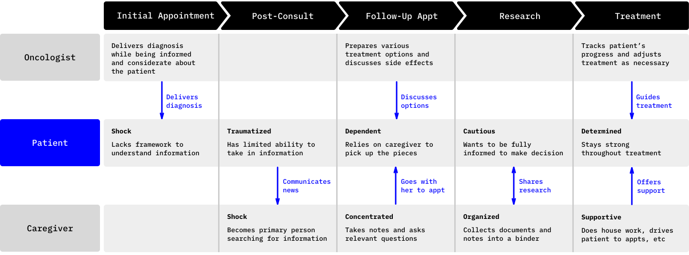
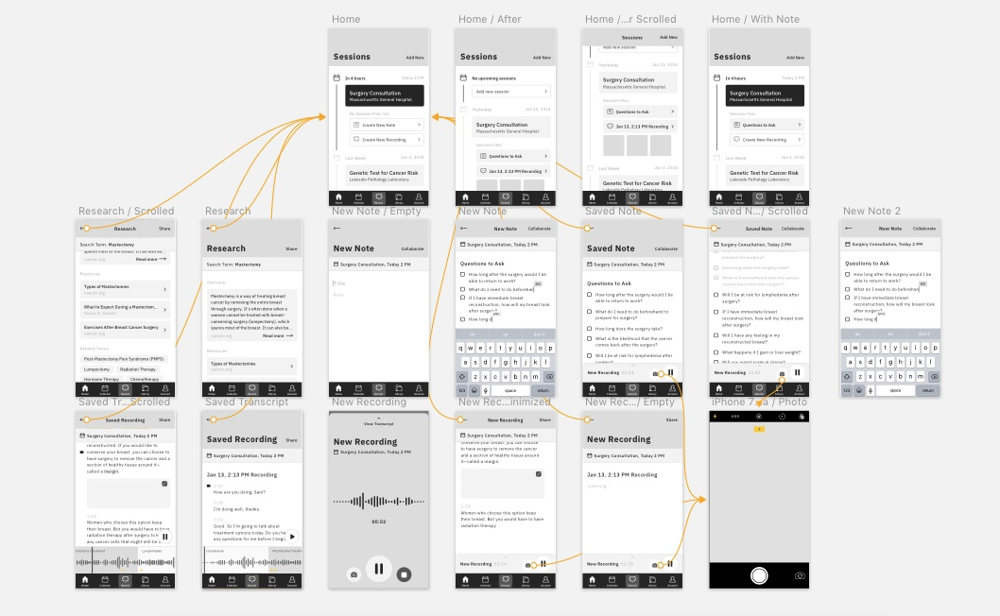
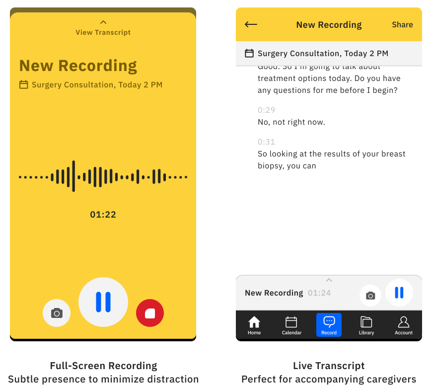
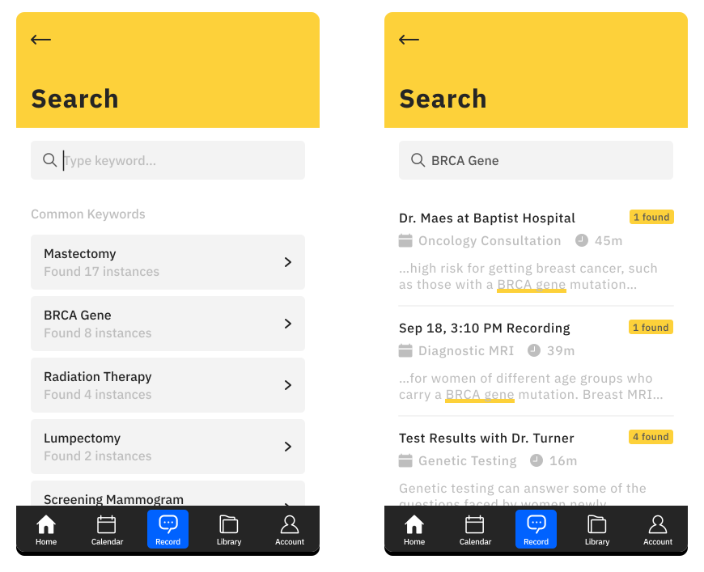

In April 2016, IBM and the American Cancer Society announced a partnership to create an AI mobile app for those fighting cancer.

## Background

Founded in 1913, the American Cancer Society (ACS) sought to raise public awareness on a subject that was, at the time, responded to with fear and silence. Since then, cancer deaths have <a href="https://www.cancer.org/about-us/who-we-are/our-history.html" target="_blank">dropped 25%</a> in the United States and open conversations have become vital to a higher quality of life during cancer experiences.

However, even with advances in modern medicine and supportive care, <a href="https://www.ncbi.nlm.nih.gov/pubmed/25180371" target="_blank">numerous</a> <a href="https://www.ncbi.nlm.nih.gov/pubmed/12923796" target="_blank">studies</a> still show concern that lay understanding of cancer is suboptimal. *Patients and their caregivers lack the medical framework to fully comprehend and manage their cancer.*

<blockquote class="hasQuotes">
  
Information acquired [in the 100 days following diagnosis] shapes and defines patients' perspective about their condition.

    <cite>
      
Weisman AD, Worden JW

      
The existential plight in cancer: significance of the first 100 days.

    </cite>
</blockquote>

In order to improve patients' understanding of their cancer, ACS and IBM saw an opportunity to combine powerful resources from both sides: ACS's massive database of cancer knowledge and IBM's artificial intelligent features, widely personified as "Watson". *The mission was to build a consumer-facing mobile app that empowers patients and caregivers to be more educated about their cancer.*

## My Role

This was an ambitious project spearheaded by an early product development team within IBM. *I joined as the product designer in October 2016 and worked with a project lead and three user researchers.*

Together, we were responsible for biweekly updates to both ACS and IBM stakeholders as well as the final hand off to the production team in February 2017.

## Early Insights

To begin, we leveraged our partnership with ACS to speak to specialists at various facilities, including a call center in Austin and <a href="https://www.cancer.org/treatment/support-programs-and-services/patient-lodging/hope-lodge.html" target="_blank">Hope Lodges</a> in Boston and New York.

*Our objective was to understand the information-seeking patterns of cancer patients when they reached out to these resources.*

In summary, we found that patients typically engaged with ACS specialists in order to:

### Recognize credible and up-to-date sources
As information online continues to be more comprehensive and accessible, patients struggled to recognize credible and truthful sources. This was especially difficult as the medical domain around cancer is constantly updating.

### Find relevancy in a sea of information
Patients rarely dialed in to the call center because they couldn't find information. Instead, they struggled to distinguish of all the information that they were given and had available, what was actually relevant to their diagnosis and progress?

### Build meaningfuls conversation with doctors
When patients looked up information outside of a doctor's appointment, their goals typically were to prepare more educated questions for the next consult, become more confident about their doctor's decisions, and follow up on any confusing concepts from the appointment.

## The Cancer Journey

Nearly 40% of men and women in the US will be diagnosed with cancer within their lifetime. Each patient stands to undergo the most emotionally and physically significant experience they will ever have.

To understand this experience, we interviewed 8 patients, 15 caregivers, and 43 healthcare professionals ranging between oncologists, nurses, and medical assistants.

<figure class="js--zoom">
  
  <figcaption>The cancer journey at a high level</figcaption>
</figure>

After gaining a more sophisticated understanding of the cancer journey, we noticed a few key insights:

### Patients' caregivers were typically their family members

Of all the patients we spoke to, very few were able to afford a licensed caregiver. Instead, *most caregivers were the patient's spouse or children*, who would take up additional housework and accompany them to the doctor's.

And because these family members often didn't have a medical background themselves, they often coped with their sense of helplessness by becoming the primary person researching and compiling cancer information in order to support the patient.

### Doctors remained the preferred source of information

Despite an increasing variety and volume of cancer resources through the internet, *patients still preferred to seek answers from their doctors because they were able to provide the most relevant and credible answers.*

And even when patients expressed concern about their doctor's judgement and wanted a second opinion, they consulted with other doctors from a different facility.

### Patients wanted to revisit their conversations with their doctor

Caregivers often accompanied patients to their oncology appointments in order to be an extra pair of ears and take copious notes. However, since caregivers were typically unlicensed, they struggled to properly capture the medical jargon or concepts that doctors may bring up.

As a result, doctors said that *many patients recorded their consultation sessions even when their caregivers came in with them.* They would then take the tape home, rewind to understand the content, and come back with more questions.

## Design Process

Over the last month of this project, we dedicated our time to conducting early concept testing with an additional 4 more patients and 3 caregivers, all of whom have experienced cancer treatment.

<figure class="js--zoom">
  
  <figcaption>Early concept wireframes used during evaluative research</figcaption>
</figure>

*Equally important in this process was working closely with the Watson cognitive services development team* in order to understand current and near future capabilities that we can feasibly support.

Therefore, from almost a dozen distinct concepts, we were able to narrow it down to just one.

## The Solution

Although there were an abundance of opportunities along the entire user journey, we found that improving comprehension of cancer at the doctor's office would have the most potential. *In an environment with a wealth of knowledge but no medical degree, both patients and caregivers struggled to take full advantage of doctor consultations.*

As a result, we designed a digital counterpart in the room that would make discussing complex topics more accessible and informative.

### Focus less on taking notes, more on the conversation

Doctors today are already accustomed to patients taping their sessions in order to digest the heavy amounts of information that they talk about.

We leveraged this behavior without disrupting it by *enabling users to record the conversation with the addition of speech-to-text transcription.*

<figure class="js--zoom">
  
</figure>

This empowers patients to focus interacting with the doctor during the conversation and the caregiver to actively listen instead of jotting down words they don't understand.

Here is an example interaction in full:

<figure>
  <video loop autoplay controls name="Users can record the conversation at the doctor's office, take photos without stopping the tape, and view the speech-to-text transcription in real-time." poster="../assets/img/acs/proto_record_poster.jpg" src="../assets/img/acs/proto_record.mov" height="500px"></video>
  <figcaption>Users can record the conversation at the doctor's office, take photos without stopping the tape, and view the speech-to-text transcription in real-time.</figcaption>
</figure>

### Search through any conversation

Currently, patients keep archives of voice memos or a binder of notes as traceable receipts for important discussions they're afraid of forgetting.

But as conversations are transcribed to text in the app, each word is indexed so that *users can search through them at any time and no discussion is ever lost.*

Search also suggests the most incidental keywords across all conversations so patients can find recordings by theme.

<figure class="js--zoom">
  
  <figcaption>Users can store, track, and search through every conversation.</figcaption>
</figure>

### Rewind and review key topics

Once a patient leaves the doctor's office, they often want to revisit the conversation and do personal research on major topics. But even with speech-to-text, reviewing hours of transcripts is still tedious.

By training on the vast ACS database, *Watson can recognize and highlight keywords of interest in the transcript and break down the recording into sections of major topics so patients have digest the content quicker.*

*The highlighted keywords also serve as faster, in-context search queries* by allowing users to click on them and be directed to ACS-approved resources on the phrase.

The aim for this process is to reduce the frequent "I don't know what I don't know" phenomenon. Traditionally, patients have to reconstruct what they took away from their doctor into a completed question to ask elsewhere. Instead, we lower the research barrier and use the recorded conversation itself as a search generator.

Here is the final interaction:

<figure>
  <video loop autoplay controls name="After the appointment, users can review both the transcript and recording and dive into highlighted keywords that Watson recognizes from the ACS database." src="../assets/img/acs/proto_transcript.mov" height="500px"></video>
  <figcaption>After the appointment, users can review both the transcript and recording and dive into highlighted keywords that Watson recognizes from the ACS database.</figcaption>
</figure>

## Next Steps

Over a span of just 5 months, we were able to deliver a powerful concept validated by extensive user research. However, because of the short timeframe, there were a few considerations that were de-prioritized.

As a result, *we advised the production team upon hand-off with a few key next steps:*
- During concept testing, many users expressed desire for Watson to summarize each transcribed conversation. Perhaps pin this as a future milestone.
- The prototypes do not reflect final visual design decisions. Please deliberate how to tie both ACS and IBM brands together.
- It's important to further explore the doctor consultation environment so that recording the conversation does not become intrusive or uncomfortable.
- Directing users to ACS sanctioned resources based on highlighted keywords was highly valuable for patients. Dive deeper into how this information can be presented in a useful way, including leveraging additional tools we haven't yet considered (such as dialing the ACS call center).
- We encountered a surprising number of non-native English patients and caregivers during our user interviews. Consider multi-lingual support for transcripts.
- In afterthought, we wished we'd spent more time on optimizing accessibility. We ask that the production team take this initiatve as it is relevant to many of our users.

## Outcome

It was clear from our final presentation to ACS and IBM stakeholders that we suceeded in generating excitement and buy-in from both sides. *Unfortunately, this partnership project is now being put on hold and we hope that it returns from its hiatus in the near future.*

We are happy, however, to have developed a collaborative relationship with ACS and their various facilities during out engagement so that design is able to connect with patients and caregivers on a regular basis.
