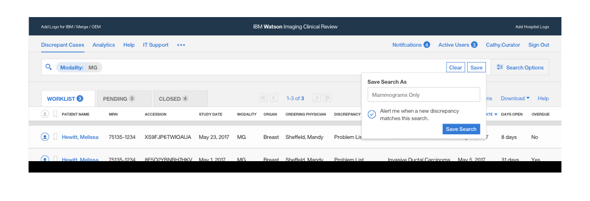

As part of IBM's second release of Watson Imaging Clinical Review, I re-examined the way users navigate the application's complex database.

## Background

In early 2017, IBM <a href="https://www.ibm.com/blogs/watson-health/introducing-ibm-watson-imaging-clinical-review/" target="_blank">launched</a> Watson Imaging Clinical Review (WICR) as an NLP-based tool that inspects clinical documents in the hospital and raises flags for any incompleteness or inaccuracies.

Although this process is incredibly important as a part of standard care, hospitals do have to pay extremely high fees in order to train their staff to use the platform. So for WICR v2.0, IBM wanted a way to reduce costs that might impact the bottom line and *our team took the opportunity to overhaul the entire user experience.*

## My Role

Effort towards WICR v2.0 began in late 2016, at which time I joined as the product designer and worked closely with a design lead, a user researcher, and an offering manager.

During my involvement until July 2017, I was hands-on for every aspect of the redesign. *While I cannot share all of my work, this post reveals some pieces that I owned but ultimately didn't make it to the final product.*

## The Problem

One of the biggest pain points for WICR users was the discrepancy table from which they would find and select flagged issues. *Due to the sheer volume and complexity of information associated with each issue, the table quickly became overwhelming and difficult to navigate.*

<figure class="js--zoom">
  
  <!-- <figcaption>Trying to find specific issues in this discrepancy table can be limiting and confusing.</figcaption> -->
</figure>

## Quick Fixes
Before some real changes, there were a few obvious opportunities for improvements in the current design.

### Emphasize the search bar

The search bar was so tiny and tucked away that discoverability for users was very low. It was also placed above the navigation bar which created some hierarchical confusion.

<figure class="js--zoom">
  
</figure>

### Separate case stages by tabs

There are three resolution stages for each discrepancy issue: open, pending, and closed. The discrepancy table distinguished each of these via individual table elements wrapped in its own open accordion element and stacked on top of each other. This created navigational and discoverability problems.

<figure class="js--zoom">
  
</figure>

## Redefining Search

The main complaint we received about the search and filter functions was that they weren't nearly as comprehensive enough to match the complexity of the discrepancy database itself. WICR users didn't feel like they had full control over how they wanted to drill down to issues.

With 25 total categories to search from, each with its own set of operators and data types, *we needed to overhaul search in a way that would provide organization and control.*

<figure>
  
  <figcaption>The range of data types for each category</figcaption>
</figure>

### First Attempt

By default, WICR v1.0 offered five filters. However, this was often difficult to correlate with the column it was filtering and limited in terms of options.

<figure class="js--zoom">
  
  <figcaption>Filters didn't correspond with table columns</figcaption>
</figure>

*Our first attempt then was to add and associate filters to each column.* For certain appropriate columns, we also introduced freeform text inputs instead of dropdown options to broaden search capabitilies.

<figure class="js--zoom">
  
  <figcaption>1st attempt: attach each filter to its column</figcaption>
</figure>

Unfortunately, user feedback wasn't entirely positive. While we solved the initial need to match filters to columns, we created a couple of new problems:
- Users weren't certain whether they should search in the broad search bar up top or in individual filters beneathe each column
- The filters were too busy and added a lot of noise to an already crowded interface
- There was no obvious way to search within the many more additional categories that weren't visible as a column
- There was no accommodation for operators (ex: more than 4 days)

### Second Attempt

*Our next attempt aimed to increase control and decrease visual noise.* We did this by hiding the actual filter building process unless explicitly called for while still allowing the use of operators and different datatypes for every potential category.

<figure class="js--zoom">
  
  <figcaption>2nd attempt: Allow even finer and more powerful controls while reducing default visual noise</figcaption>
</figure>

While this design was much closer than the last one, there were still some interaction points that could have been finessed. Our usability testing revealed that:
- In the default state without any set filters, users missed the "Add Filter" button because they were looking for a search bar
- Building multiple filters was tedious and slow&mdash;there were too many unnecessary clicks

### Final Solution

Closely iterating on the last attempt, we finalized the concept of *Search Formulas, a set of building block searches that can be combined to be as comprehensive as necessary.*

Each Search Formula reflects a selected set of category, operator (if more than one for this category), and value so that users can compartmentalize what they were looking for.

<figure>
  
</figure>

However, rather than creating Search Formulas like we did in the second attempt, *we realized that there were two distinct behaviors of nagivating the database that we needed to accommodate.*

### Casual users have all their options laid out

Doctors who only logged into WICR to resolve discrepancies that were flagged to them did so infrequently and used a small portion of the application when they did.

As a result, having visual choices and feedback was important to casual users who weren't familiar with the entire search toolbelt. *The manual selection method then is straightforward and comfortable.*

<figure class="js--zoom">
  <video controls loop autoplay name="Manual search using modal inputs" src="../assets/img/clinicalreview/manualsearch.mov"></video>
  <!-- <figcaption>Made in Framer</figcaption> -->
</figure>

### Power users can just start typing

On the other hand, hospital staff such as nurses and medical coders were responsible for reviewing clinical documents and logged into WICR almost daily to moderate and even police the platform by sending resolution notices to doctors.

*Therefore, a more efficient alternative for these power users is to type directly into the search bar.* To provide further help, an autocomplete box follows the cursor and offers look-ahead feedback.

<figure class="js--zoom">
  <video controls loop autoplay name="Quick search by directly typing into search bar" src="../assets/img/clinicalreview/typesearch.mov"></video>
  <!-- <figcaption>Made in Framer</figcaption> -->
</figure>

## Enhancements

While Search Formulas was well-received and took care of most of the complaints that users had, we didn't stop there and continued with additional enhancements.

### Give users control over their table columns

By default, the discrepancy table only fits 12 out of the 25 possible category columns, leaving the rest simply out of view. Requests for additional columns had to be added by the IT administrator, which would then be implemented across the application for every user in the hospital.

This meant that users who had different objectives were loaded with information that they may not need and we were creating technical burden on the hospital by relying on the IT admin to do simple adjustments.

Therefore, *we gave each user individual control over the columns they wanted to see*, which was configurable with the following sidebar.

<figure class="js--zoom">
  
</figure>

### Expedite frequently used searches

One observation with users was that they often performed repeated searches. Doctors would consistently search by their own name to get the issues they needed to resolve and nurses would search by the department she was responsible for monitoring.

To save all these users time, *we persisted a history of their most recent searches and allowed users to save the current set of Search Formulas*. These stored searches were accessible in both the search bar and the search options modal.

<figure class="js--zoom">
  
</figure>

<!-- <figure class="js--zoom">
  
</figure> -->

To take it a step further, we also offered the option to notify the user when a new discrepancy issue matching the saved search arrives.

## Results

Although these designs didn't make it to the final product, the substantial amount of work that did was the result of the team's fast iterations and continuous user research. *Together, we were able to overhaul every single existing functionality and push for a couple new ones.* We were also able to excite the healthcare community by personally showcasing the second release at some major tradeshows.

WICR v2.0 is now in its final stages of development and is expected to launch in late 2018.
