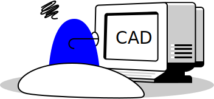

Women worldwide depend on routine mammograms to identify findings in their breast that may suggest cancer. But with an alarming shortage of radiologists to read and interpret these images, we use machine learning to take on the job.

This project is a less traditional example of work as a product designer, where the final solution in reality has little to no interface. Instead, I helped to design a service that works behind the scenes and it is the most ambitious and promising project I've worked on at IBM.

## My Role

*I was the product designer and worked daily with the offering management, research, regulatory, and development teams* in order to deliver a solution that made sense to both the user and the business.

## Finding Opportunity

Care Advisor is a suite of offerings within IBM Watson Health Imaging. Care Advisor for Breast (CA-Breast) was the inaugural offering within this suite, which was was kicked off with the idea to apply machine learning in order to read breast x-rays, aka mammograms. However, the application of this technology needed to be determined.

For 6 months, offering management and design jointly conducted ethnographic field research at 5 breast imaging institutions with 22 total participants. *Our goal was to embed ourselves within the problem space in order to identify an opportunity that would both differentiate us competitively and solve a user need using machine learning on mammograms.*

These were our key insights from that research:

<figure class="m--content_figure m--content_figure-right">
  
  <figcaption>Long, busy hours</figcaption>
</figure>

**1. Screening is the least important part of a radiologist's day** 
Radiologists performed tasks far beyond screening mammograms, such as diagnostic imaging (for patients who come in with known issues) and biopsy procedures. Among those, screening mammograms are actually the lowest priority due to its non-urgent nature and the most annoying because there are so many and 90% them are totally normal.

**2. There are more generalists than specialists** 
Only 30% of mammograms were read by breast imaging specialists, which are radiologists with additional fellowship training specializing in breast imaging. This means higher reliance on generalists who read across multiple body systems without a specialization in any of them.

<figure>
	
</figure>

<figure class="m--content_figure m--content_figure-left">
  
  <!-- <figcaption>Highly regulated</figcaption> -->
</figure>

**3. Mammography is highly regulated and standardized** 
Due to the poor quality of mammography in the 1990s, the FDA implemented MQSA to regulate the way they are performed. These set of rules and subsequent guidelines by accreditation bodies ensured that every mammogram at the most part followed the same procedures, right down to the structure and content of the final report that radiologists write their findings into.

<figure class="m--content_figure m--content_figure-right">
  
  <!-- <figcaption>Long, busy hours</figcaption> -->
</figure>

**4. Breast imaging has "suffered" from AI already** 
Computer-aided detection (CAD) was an initiatve to make sure nothing was ever missed in the mammogram by pointing out areas of suspicion to the radiologists. This technology was widely adopted but ultimately became known as a nuisance. Only 20% of the radiologists we observed looked at the CAD markings before their own interpretation and most agree that it was like reading with a medical student.

## Post-Exploratory

Now that we completed our generative research, we came away with some important considerations:
1. *We were on the right track. Screening mammograms was a tasking process that deserved automation.*
2. The failure and negative perception of CAD foreshadowed our next steps.
3. Healthcare professionals were also wary of AI in general, both in terms of patient safety and its potential to replace their jobs

From the exploratory phase, we came away with 10 concepts that design ranked in order of user value. The research, regulatory, and development teams each countered with feasibility estimates and offering management closed the loop with value to the business. This allowed us to narrow them down to just 1 remaining.

## Full Normal Reads

*CA-Breast will perform Full Normal Reads, a solution that handles the end-to-end read of normal mammograms.* Let's break that down:

### End-to-End
While other concepts considered partial automation or enhancement of the radiologist's workflow, *the solution fulfills the entire process from the moment the mammogram is received to final result submission, without ever requiring human intervention*.

### Normal Reads
CA-Breast only fully automates screening mammograms that CA-Breast assesses to be "normal", or completely without findings indicative of cancer.

## Definition

## Designs

Because our solution is an entirely autonomous read of the 

## Outcome

The product is currently being tested in the wild at hospitals and undergoing regulatory review by the FDA.

I am now focusing on expanding this solution to a worldwide market, starting from the UK.

