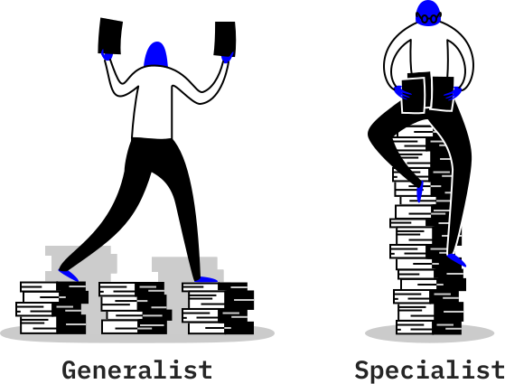

Care Advisor is a suite of "moonshot" AI offerings where each explores one division of medical imaging. This is my part in one of those moonshots.

Note that this project is a less traditional example of my work as a product designer because the final solution has no interface. Instead, I helped design and build the most ambitious AI service within the IBM Watson Health portfolio. However, if you're really looking for an interaction design example, see <a href="../work/ibm-clinical-review.html">IBM Watson Clinical Review</a>.

## My Role

<figure class="m--content_figure m--content_figure-left">
  
</figure>

Care Advisor for Breast (CA-Breast) kicked off in early 2017 and *I began work as the team's product designer in July 2017*. I collaborated with the offering management, research, regulatory, and development teams in order to bring this product to a global market.

At the beginning of this project, I was responsible for identifying and exploring the opportunity space given a broad direction. Once early validation was proven, I became responsible for designing and defining the solution, including the training and implementation of our machine learning algorithm.

*I am still part of this project but this post only reflects my work on the team up until March 2018.*

## The Problem

Mammography is the most effective non-invasive procedure used to detect early signs of breast cancer. As a result, women worldwide depend on radiologists, which are doctors that diagnose diseases using medical imaging, to identify any findings in their breast that may indicate cancer.

These radiologists are responsible for looking at, or "reading", the mammograms, after which they submit a report back to the patient's primary care physician, detailing what they find.

*However, the business challenged us with an open problem: there is a global shortage of radiologists and institutions are struggling to keep up with mammography demand.*

Our high level goals were to:
- Address the increasing global backlog of mammograms
- Leverage artificial intelligence as part of the Care Advisor suite
- Empower radiologists&mdash;not replace them

## Early Insights

During the project's inaugural 6 months, offering management and design conducted ethnographic field research at 5 breast imaging institutions with 22 total participants. *Our goal was to embed ourselves within the problem space in order to identify an opportunity that would both differentiate us competitively and solve a concrete user need.*

<figure class="m--content_figure m--content_figure-right">
  
  <!-- <figcaption>Long, busy hours</figcaption> -->
</figure>

### 1. Radiologists have to cram in mammograms in between other tasks

Radiologists performed tasks far beyond mammograms, such as diagnostic imaging (for patients who come in with known issues) and biopsy procedures. Since those tasks involve scheduled facetime with patients, they could only read mammograms whenever they had a small window of time, hoping that they'll be able to get all of it done by the end of the day.

### 2. Reading mammograms is like finding a needle in a haystack

Among all the mammograms that radiologists look at, at least 90% of them are completely normal and the patient just comes back for screening again next year. As a result, radiologists have to go through a high volume of studies, searching for the small handful with signs of cancer that they can't afford to miss.

<figure class="m--content_figure m--content_figure-left">
  
  <!-- <figcaption>Highly regulated</figcaption> -->
</figure>

### 3. Mammography is highly regulated and standardized

Due to the poor quality of mammography in the 1990s, the FDA implemented MQSA to regulate the way they are performed. These set of rules and subsequent guidelines by accreditation bodies ensured that every mammogram in the country followed the same procedure, from the way the mammogram is captured to the structure of the final report. Changes to these standards would be very difficult.

<figure class="m--content_figure m--content_figure-right">
  
  <!-- <figcaption>CAD has a bad reputation in breast imaging</figcaption> -->
</figure>

### 4. The breast imaging community has "suffered" from AI already
Computer-aided detection (CAD) was an initiatve to make sure nothing was ever missed in the mammogram by pointing out areas of suspicion using AI. This technology was widely adopted but ultimately received extremely negative reviews. Only 20% of the radiologists we observed looked at the CAD markings before their own interpretation and most agree that it was like reading with a medical student.

## Rethink the Problem

Once we wrapped up generative research, we at least knew that we were on the right track: reading mammograms is a tasking process that needed to be improved.

However, the initial problem needed to be redefined: *although the shortage of radiologists is a major problem outside the US, we observed that American institutions instead suffered from a shortage of radiologists who specialize in breast imaging.*

This is because while all radiologists are certified to and do read mammograms, only 10% are specialists who completed a fellowship focusing on breast imaging. This means a high reliance on generalists who read across many body systems without a particular specialization in any of them.

<figure>
	
</figure>

This raises two concerns:
1. General radiologists may not perform at the same level as specialists, particularly on more complex and suspicious cases
2. The short supply of specialists may be wasting their time and expertise by looking at so many normal mammograms.

*Our directive now then is to be able to address both the shortage of specialists in the US and the global shortage of radiologists overall within one solution.*

## The Solution

For the next few weeks, I worked through 10 potential concepts with the research, regulatory, and development teams, balancing user value with technical and legal feasibility.

With final blessing by offering management, *our emergent concept was Full Normal Reads, a solution that completely automates the end-to-end read of normal mammograms.* Let's break that down:

### End-to-End

Radiologists in reality only spend 90 seconds to read a completely normal case, from opening the study to submitting a report. While other early concepts considered partial automation or enhancement of the radiologist's workflow while reading, the opportunity window was simply too short to bring true value.

*CA-Breast therefore fulfills the entire process from the moment the mammogram is received to submitting the final report, without ever requiring human intervention.*

<figure>
	
	<!-- <figcaption>CA-Breast takes mammograms off the queue, processes it, generates a final report, and signs it off.</figcaption> -->
</figure>

### Normal Reads

However, we do not aim to replace the radiologist. We wish to take mundane, repetitive cases off the table so that:
- In the US, breast imaging specialists can focus on complex cases that take fuller advantage of their expertise
- Globally, radiologists handle less studies overall

*As a result, CA-Breast only performs a read on mammograms that the algorithm finds to be normal. This means that we will always leave the suspicious cases to a human reader.*

<figure>
	
	<!-- <figcaption>CA-Breast first reviews whether it believes the mammogram to be normal before moving forward. If abnormal, it defers it to the radiologist.</figcaption> -->
</figure>

## Product Definition

Although CA-Breast now had a much clearer direction, the specific inputs and outputs of the solution needed to be defined.

*For the next 4 months, I conducted evaluative user research with the objective of understanding existing human practices and performance levels so that the solution will imitate or compliment them.*

### 1. Prior mammograms are vital to decision-making.

There is no way to know what is truly normal within a woman's breast. Any patient may have natural biological markers that are unique to her.

Radiologists determine normal by comparing the current study to those from previous years for the same patient. They then look for findings that are new or growing in size.

<figure>
	
</figure>

*Therefore, algorithm must consider not only the current mammogram, but also a set of priors in order to make an informed assessment.*

<figure class="m--content_figure m--content_figure-left">
  
</figure>

### 2. Higher risk women should be managed differently

Depending on personal and family history of breast cancer, as well as rare genetic mutations, some women are predisposed to develop breast cancer. These patients should receive additional considerations, such as supplementary MRI, shorter intervals between screenings, and so on.

*As a result, CA-Breast must keep recommendation options configurable per site basis.* Not all sites agree on the same recommendation for high risk patients and we should not make that decision for them.

<figure class="m--content_figure m--content_figure-right">
  
</figure>

### 3. Writing radiology reports is an art

Even if their mammogram has no signs of cancer, most women present with some sort of benign finding. Radiologists wildly disagree when it comes to whether to just omit them from the report or, if not, how to even describe them.

This was a difficult problem since an algorithm executes tasks within a distinct set of rules. But with the controversial and complex nature of writing a medical report, it isn't as simple as a configuration setting.

My response was to acklowedge CA-Breast to have a certain personality type that carries a set of preferences. Disagreement would be impossible to avoid no matter what but if radiologists can understand its working style like they would with a colleague, it can reduce frustration.

*After mapping the reporting styles of over 30 radiologists, I determined that CA-Breast would assume a moderately liberal personality*, which is identified with the following behaviors:
- It omits findings from the report that are irrefutably benign
- For benign findings that it does describe, it does so only to the extent that it's obvious what and where it is in the mammogram.
- It would group similar findings wherever possible. Rather than separately reporting "X calcification at location A, Y calcification at location B", it might say "calcifications in [general area]".

## Where We Are Now

Once the product definitions were in place, I worked closely with the research and development team to deliver our first MVP. This version is now being tested at hospitals and undergoing regulatory review by the FDA in the US.

I am currently focusing on expanding this solution to a worldwide market, starting from the UK.

