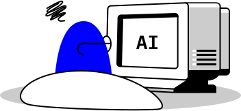

Care Advisor is a suite of "moonshot" AI offerings where each explores one division of medical imaging. This is my part in one of those moonshots.

Notable is that this project is a less traditional example of my work as a product designer because the final solution has no real interface. Instead, I helped design and build the most ambitious AI service within the IBM Watson Health portfolio. However, if you're really looking for a more interaction design example, see <a href="../work/ibm-clinical-review.html">IBM Watson Clinical Review</a>.

## My Role

<figure class="m--content_figure m--content_figure-left">
  
</figure>

Care Advisor for Breast (CA-Breast) kicked off in early 2017 and *I began work as the team's product designer in July 2017*. I worked daily with team leads from offering management, research, regulatory, and development in order to bring this product to a global market.

At the beginning of this project, I was responsible for identifying and exploring the opportunity space given a broad direction. Once early validation was proven, I became responsible for designing and defining the solution, including the training and implementation of our machine learning algorithm.

While I am still part of this project, this post only reflects my work on the team up until March 2018.

## The Problem

Mammograms are the most effective but non-invasive practice used to detect early signs of breast cancer. As a result, women worldwide depend on radiologists to read screening mammograms in order to identify findings in their breast that may indicate cancer.

*However, the business challenged us with an open problem: there is a global shortage of radiologists and institutions are struggling to keep up with screening demand.*

Our high level goals were to:
- Leverage artificial intelligence as part of the Care Advisor suite
- Empower radiologists and enhance their work&mdash;not to replace them
- 

<!-- Although we roughly knew from the start that we wanted apply machine learning to reading mammograms, we didn't actually know what that means. -->

## Early Insights

During the project's inaugural 6 months, offering management and design conducted ethnographic field research at 5 breast imaging institutions with 22 total participants. *Our goal was to embed ourselves within the problem space in order to identify an opportunity that would both differentiate us competitively and solve a concrete user need.*

<figure class="m--content_figure m--content_figure-right">
  
  <!-- <figcaption>Long, busy hours</figcaption> -->
</figure>

### 1. Radiologists have to cram in mammograms in between other tasks

Radiologists performed tasks far beyond screening mammograms, such as diagnostic imaging (for patients who come in with known issues) and biopsy procedures. Since those tasks involve scheduled facetime with patients, they could only read screening mammograms whenever they had a small amount of time, hoping that they'll be able to get all of it done by the end of the day.

### 2. Reading mammograms is like finding a needle in a haystack

Among all the screening mammograms that radiologists look at, at least 90% of them are completely normal and require no additional investigation, meaning the patient simply returns next year. As a result, radiologists have to go through a high volume of studies and only a few of them are actionable.

<figure class="m--content_figure m--content_figure-left">
  
  <!-- <figcaption>Highly regulated</figcaption> -->
</figure>

### 3. Mammography is highly regulated and standardized

Due to the poor quality of mammography in the 1990s, the FDA implemented MQSA to regulate the way they are performed. These set of rules and subsequent guidelines by accreditation bodies ensured that every mammogram at the most part followed the same procedures, right down to the structure and content of the final report that radiologists write their findings into.

<figure class="m--content_figure m--content_figure-right">
  
  <!-- <figcaption>CAD has a bad reputation in breast imaging</figcaption> -->
</figure>

### 4. The breast imaging community has "suffered" from AI already
Computer-aided detection (CAD) was an initiatve to make sure nothing was ever missed in the mammogram by pointing out areas of suspicion using AI. This technology was widely adopted but ultimately received negative reviews. Only 20% of the radiologists we observed looked at the CAD markings before their own interpretation and most agree that it was like reading with a medical student due to its high false positive rate.

## Rethink the Problem

Once we wrapped up generative research, we at least knew that we were on the right track: screening mammograms were a tasking process that deserved automation.

However, the problem needed to be redefined. *While the shortage of radiologists is a major problem outside the US, we observed that American institutions instead suffered from a shortage of radiologists who specialize in breast imaging.*

<figure>
	
</figure>

Only 30% of mammograms are read by breast imaging specialists, which are radiologists with additional fellowship training specializing in breast imaging. This means a high reliance on generalists who read across many body systems without a specialization in any of them.

This raises two concerns:
1. General radiologists may not perform at the same level as specialists, particularly on more complex and suspicious cases
2. The already short supply of specialists may be wasted on looking at normal mammograms that do not warrant such high expertise

## The Solution

For the next few weeks, I worked through 10 potential concepts with the research, regulatory, and development teams, balancing user value with technical and legal feasibility.

With final blessing by offering management, *our emergent concept was Full Normal Reads, a solution that handles the end-to-end read of normal mammograms.* Let's break that down:

### End-to-End

Radiologists in reality only spend 90 seconds to read a completely normal case, from opening the study to submitting a report. While other early concepts considered partial automation or enhancement of the radiologist's workflow, the opportunity window was simply too short to bring true value.

CA-Breast therefore fulfills the entire process from the moment the mammogram is received to final report generation, without ever requiring human intervention.

### Normal Reads

However, we do not aim to replace the radiologist. We wish to take mundane, repetitive cases off the table so that:
- In the US, breast imaging specialists can focus on complex cases that take fuller advantage of their expertise
- Globally, radiologists handle less studies in general

As a result, CA-Breast only performs a read on mammograms that the algorithm finds to be normal. This means that we will always leave the suspicious cases to a human reader.

## Product Definition

Although CA-Breast now had a much clearer direction, the specific inputs and outputs of the solution need to be defined.

*For the next 4 months, I conducted evaluative user research with the objective of complimenting our solution with existing human practices and performance levels with regards to reading normal screening mammograms.*

### 1. There is no universal normal. We need to compare to priors.

There is no way to know what is truly normal within a woman's breast. Any patient may have natural biological markers that are unique to her.

Therefore, it is not only good practice but also a required logistical step for the algorithm to compare the current mammogram to prior mammograms and assess whether a finding is new or has changed in appearance.

### 2. Some women may be at higher risk and should be managed differently

Depending on personal and family history of breast cancer, as well as rare genetic mutations, some women are predisposed to develop breast cancer. 

## Designs

Because our solution is an entirely autonomous read of the 

## Outcome

The product is currently being tested in the wild at hospitals and undergoing regulatory review by the FDA.

I am currently focusing on expanding this solution to a worldwide market, starting from the UK.

